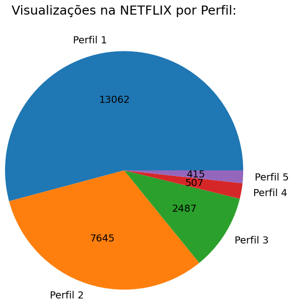
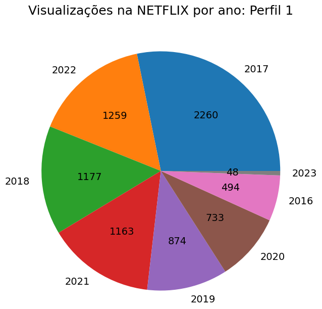
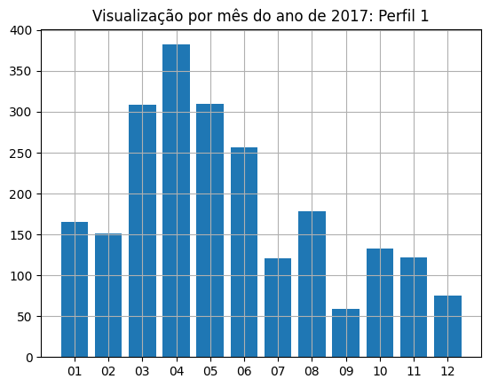

LEVEL 1 DATA ANALYSIS

Analysis of a netflix dataset

Python (Jupyter Notebook) File = <a href="netflix_analise.ipynb"> netflix_analise.ipynb </a> 
Netflix Data = "CONTENT_INTERACTION/atividades.csv"

<b> GRAPHS:   PIE GRAPH OF ALL VIEWS</b>  

  

<b>PIE GRAPH OF PROFILE 1 VIEWS BY YEAR</b> 

  

<b>BAR GRAPH OF PROFILE 1 VIEWS IN YEAR 2017</b> 

